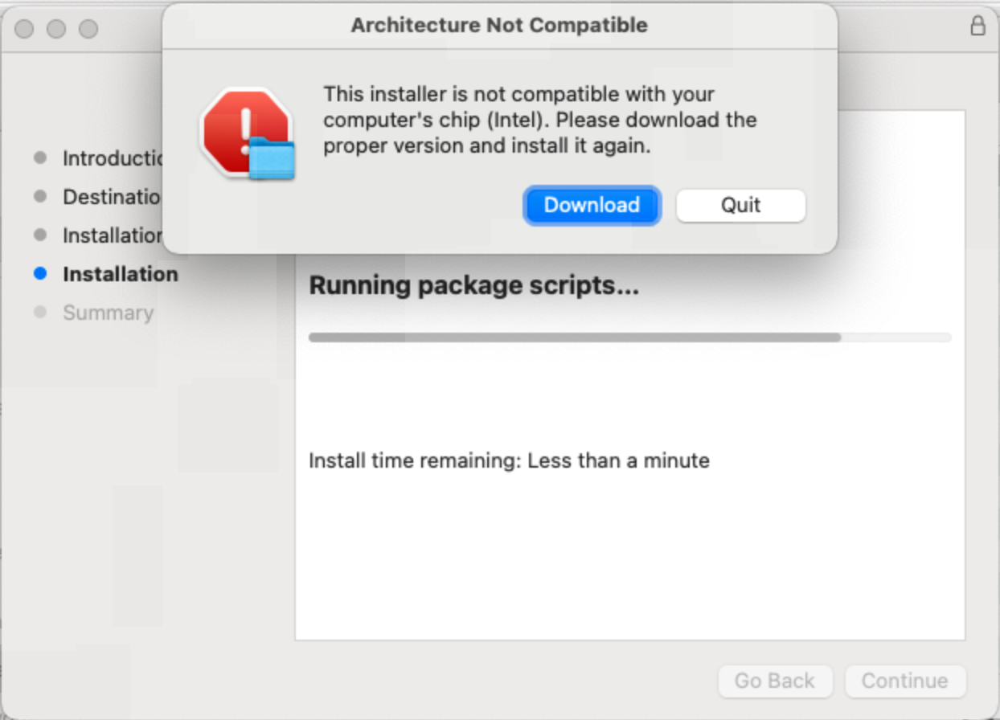

# mac-pkg-installer
An example of a macOS PKG installer to demonstrate how to check for system architecture compatibility during installation.
And open a dialog to instruct users to download the correct version if there is a mismatch. Multi-language support is included.

## Building the PKG Installer
* Replace product name, app bundle path, sign certificate, and download links in the files as needed.
* Run `build.sh` to create the PKG installers.

## Screenshots
### Architecture Mismatch Dialog (English)

### Architecture Mismatch Dialog (Chinese)

